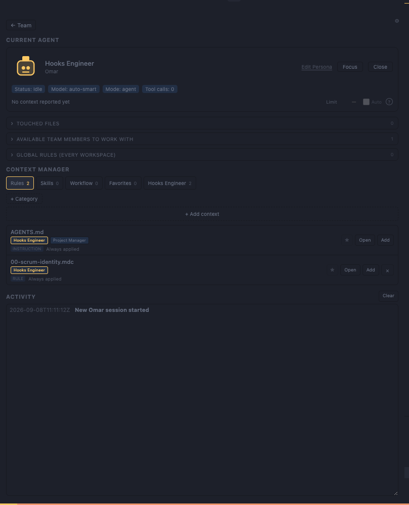

# Context Manager

**A visual scrum board over the Cursor context your repo already has — personas are hats one agent
wears, not separate bots.**


Click a figure to start a chat as that role. Names come from the project's own persona files.

## Problem

A repo's Context Manager — personas, rules, skills, workflows — is a consistent team model, but it is
invisible: markdown files and `@`-mentions. Users cannot see who owns what, who hands off to whom,
or what happened in a session.

## Solution

A **live scrum board** over the context a workspace already has, which:

1. Scans `.cursor/` and `AGENTS.md` for declared roles and the files scoped to them.
2. Displays roles as animated figures on a GUI.
3. Lets the user add, edit, retag and remove that context in place.
4. Shows declared handoffs and live activity when hooks fire, over an append-only event log.

## Users

- Teams running multi-persona agent sessions in Cursor.
- Tech leads who want visible ownership and handoffs during agent sessions.

## Run it

1. Open this repo in Cursor.
2. Press **F5** → **Run Scrum Board Extension** (compiles automatically).
3. A second Cursor window opens (Extension Development Host); the **Scrum Board** tab opens in the
   editor area, and the **robot icon** in the left activity bar has the sidebar view.

Board did not auto-open? In the dev-host window: **⌘⇧P** → **Context Manager: Open Board**.

## Two layers

| Layer | What it does |
|-------|--------------|
| **Extension** (`extension/`) | VS Code webview: roster, handoff panel, activity log. Reads `.cursor/` and `AGENTS.md`, edits those same files when you add or remove a persona or rule |
| **Hooks** (`.cursor/hooks/`) | Append agent/subagent/tool events to a session log — the only source of live activity |

The board shows **declared roles** always, and **live activity** only while hooks fire.

## What it writes

| What | Where | Lifetime |
|------|-------|----------|
| Session state — events, board state, handoff notes | `~/.cursor/agent-viz/<workspace>/` | Outside your repo; removed when the last session closes |
| Hook scripts and wiring | `.cursor/hooks/`, `.cursor/hooks.json` | Only if you accept the install prompt; appended to `.gitignore` first, so they stay out of `git status` |
| Your context — personas, rules, skills, workflows, `role-map.json` | `.cursor/` | Yours; the board never deletes it |

An empty workspace gains the hook copies and ignore lines — no personas, no role map, no invented
team.

## Commands (⌘⇧P)

- **Context Manager: Open Board**
- **Context Manager: Install Agent Hooks In This Workspace**
- **Context Manager: Restore onboarding**
- **Context Manager: Remove Agent Hooks And Board Data**

Uninstalling the extension clears `~/.cursor/agent-viz/` on its own; your personas and rules are
left alone.

## Core screens

### 1. Team roster

Personas discovered from `.cursor/personas/*.md` (per-file or one charter), else
`.cursor/agent-viz/personas.json`. **+ Add persona** writes into whichever source is already in use.

**Onboarding** is injected by the extension and leads every roster, alongside the project's own
personas rather than instead of them. It walks the user through the board and offers the Project
Manager that maps this project's context into personas — the mapping is that persona's job, not
Onboarding's. It owns no file: it never lands in `personas.json`. A project that declares a `guide`
of its own keeps its own wording in that first slot.

It is initial guidance, so it can be removed whenever the user is done with it — dismissed as a
board preference next to the runtime state, never by touching the repo. No persona is permanent,
that card included and even when it is the last one: an empty board is a state the user can ask for,
and **+ Add persona** is always on the roster. Since a removed Onboarding card leaves nothing to click,
**Context Manager: Restore onboarding** puts it back.

An unconfigured workspace is left untouched: the roster is Onboarding plus a setup panel, and the
first file appears only when the user adds a persona.

The walkthrough happens in the chat, not in a README: the first session started while the board has
no live activity receives a board request to introduce the board and to offer the persona that maps
the repo into a team, delivered over the same handoff pipeline as any other note. That chat opens
with a short hello prefilled in its composer and unsent, so the user starts the walkthrough rather
than the board taking a turn on its own. Once per workspace, hooks required.

Onboarding closes that walkthrough with one offer: a **Project Manager**, the first persona the
project owns. It does the mapping against the code rather than from the markdown alone — reading the
declared context and the repo's actual shape, reporting where the two disagree, and proposing a
roster only the user approves into files. Declining writes nothing and is not asked again. Display
names belong in the persona files the project writes, not in the extension.

### 2. Scrum board (extension webview)

- **Roster** — figure per declared role (Onboarding, plus any personas the project adds).
- **Handoff panel** — collaborator targets from the persona charter, and the note you send one.
- **Live pulse** — role/subagent highlights on hook events.
- **Activity log** — tail of the session event log (who did what, when).

### 3. Agent detail



Clicking a figure opens the persona it belongs to: session status, model and mode, touched files,
the team members it can hand off to, and the rules, skills and workflows scoped to that role — each
tagged with the personas that own it, and openable in the editor from here.

## Event model (hooks)

Events append one JSON object per line:

```json
{"ts":"2026-08-20T13:00:00Z","type":"subagentStart","subagentType":"explore","role":"guide"}
{"ts":"2026-08-20T13:00:05Z","type":"postToolUse","tool":"Read","path":"src/App.tsx"}
```

Hook sources: `sessionStart`, `sessionEnd`, `subagentStart`, `subagentStop`, `preToolUse`, `postToolUse`, `afterAgentResponse`.

The log lives in `~/.cursor/agent-viz/<workspace>/events.jsonl`, outside the repo, and a closed
session's lines are removed with it. Keeping history would mean opting out of that cleanup.

Role mapping is **convention**: the subagent→role map lives only in
`.cursor/agent-viz/role-map.json`, which the project owns and the extension never seeds. An unmapped
subagent type keeps its own name as the role.

## Limits (honest)

- No official Cursor API for live agent thought streams or in-chat avatars.
- “Who is talking to who” = **handoff panel from personas** + **live pulse when subagents/tools run**.
- The extension reads the hook log file; it does not hook into Cursor internals.
- Cursor only runs hooks declared in the workspace, so live activity needs `.cursor/hooks/` there.

## Non-goals

- Replacing Cursor’s agent panel.
- Spawning real multi-agent bots (unless user explicitly runs `Task` subagents).
- Reading undisclosed Cursor internals.

## Docs

- [extension/README.md](./extension/README.md) — how the extension source is laid out.
