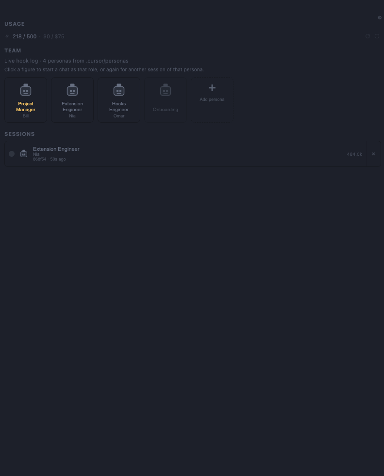

# Context Manager

**A visual scrum board over the Cursor context your repo already has — personas are hats one agent
wears, not separate bots.**

Install, layers, what it writes on disk, commands, screens and limits: **[PRODUCT.md](./PRODUCT.md)**.
